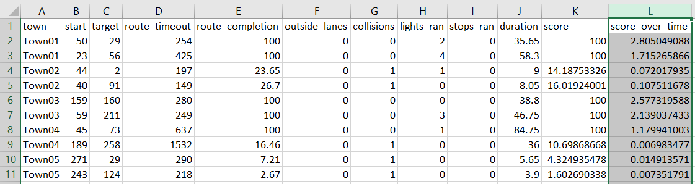
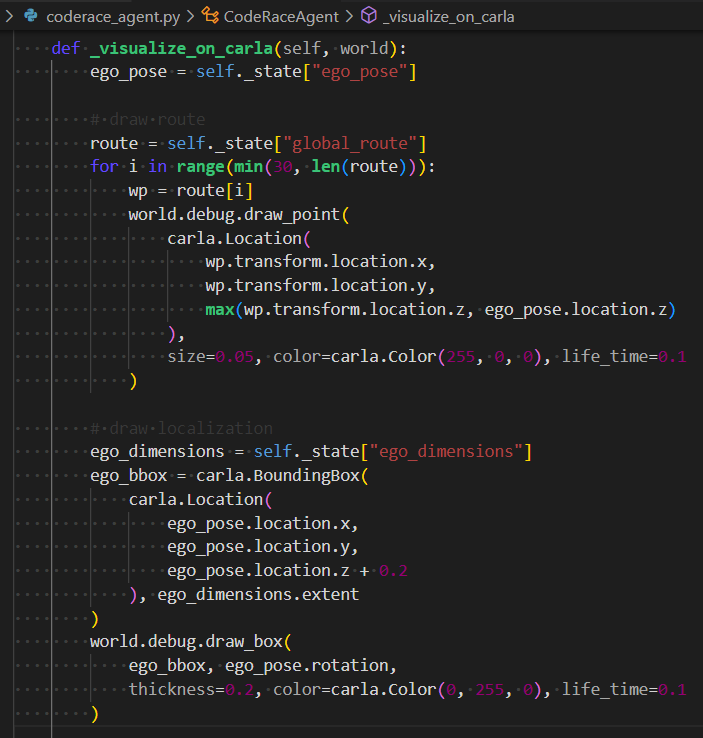

# CodeRace: CARLA Leaderboard Challenge

Your first step into the world of **ADAS (Advanced Driver Assistance System)** and **AD (Autonomous Driving)**.

## 1. Dev Environment Setup

**Prerequisites:** Laptop or PC with *NVIDIA* graphics card

### 1.1. Recommended: Ubuntu 20.04.6 LTS (Focal Fossa)
- [[Ubuntu] CARLA_0.9.11.tar.gz](https://carla-releases.s3.us-east-005.backblazeb2.com/Linux/CARLA_0.9.11.tar.gz)
- Docker ( >= 19.03 )
- Docker Compose ( >= 1.29.2 )
- [NVIDIA Container Toolkit](https://docs.nvidia.com/datacenter/cloud-native/container-toolkit/1.8.1/install-guide.html)

### 1.2. Alternative: Windows 10/11 WSL2 Ubuntu-20.04
- [[Windows] CARLA_0.9.11.zip](https://carla-releases.s3.us-east-005.backblazeb2.com/Windows/CARLA_0.9.11.zip)
- Docker Desktop ( tested at v4.27.2 )
- Docker Compose ( tested at v2.24.5 )
- [Nvidia Docker on WSL2](https://medium.com/htc-research-engineering-blog/nvidia-docker-on-wsl2-f891dfe34ab)

### 1.3. Supporting Tools

Docker management is well supported by VSCode. We recommend these extensions:
- [Docker Extension Pack](https://marketplace.visualstudio.com/items?itemName=formulahendry.docker-extension-pack)
- [Dev Containers](https://marketplace.visualstudio.com/items?itemName=ms-vscode-remote.remote-containers)

## 2. Run the Challenge

First, you'll need to pull our docker image:

```
$ docker pull maihuuthien/carla-leaderboard:coderace
```

Next, clone this Git repository and `cd` into the folder, then

```
$ docker compose up --detach
```

You can run `docker ps` to check if the docker container `coderace-dev` is running or not, before going into the container by:

```
$ docker exec -it coderace-dev bash
```

which should take you right into the `/workspace/team_code` directory.

Now, on your host, you need to launch the CARLA simulator. Inside the downloaded package you should find a shell script called `CarlaUE4.sh`:

```
$ ./CarlaUE4.sh
```

> **Note:** Launch `CarlaUE4.exe` instead if you're on Windows.

You should see some nice rendering by now. Go on, have fun navigating around by your mouse and keyboard (`W`, `A`, `S`, `D`, `Q`, `E`).


Now, go back to your docker container, still in `/workspace/team_code` directory, simply call:

```
$ sudo ./run.sh
```

and you shall see the challenge running.


## 3. About the Challenge

### 3.1. Evaluation and Metrics

We have modified the [CARLA Leaderboard](https://github.com/carla-simulator/leaderboard) source code specifically for this CodeRace competition. Our provided autonomous ego vehicle will drive through `10` different routes, filled with other NPC (Non-Player Character) vehicles. However, please note that we implemented our ego vehicle as a very simple path-tracking robot, with no consideration for obstacles. Therefore, it is expected that our ego vehicle will collide with other vehicles or static objects in the map layout, or even go out of its route lane. Such violations will incur penalties to the total score. Plese refer to the official [CARLA Leaderboard](https://leaderboard.carla.org/#evaluation-and-metrics) page for their scoring method.

Upon completion of the evaluation, you shall find in `/workspace/team_code/coderace` directory the recorded video, along with a `stats.csv` file for a summary of your statistics:



You may notice that we added a little twist here, by the `score_over_duration` column. That's how we differentiate between the ones who play *too* safe, and ones that can adapt their ego vehicle to various situations. In other words, how *fast* you complete a route also counts.

Your final score will be an average of the `score_over_duration` from each route: `SUM(K2:K11)/10`

### 3.2. Your Mission

Your mission, should you choose to accept it, is to improve our `/workspace/team_code/drivers/baseline_driver.py` module. Whatever code you add, we expect them to be within the `/workspace/team_code/drivers` directory, since you will submit this folder to us as your solution.


## 4. FAQ

### 4.1. Could not select device driver "nvidia"

During launching of our docker container, you might get this error response from the docker daemon:

> Error response from daemon: could not select device driver "nvidia" with capabilities: [[gpu utility compute video]]

then you need to add `nvidia-container-runtime` to the docker runtimes:

```
$ sudo tee /etc/docker/daemon.json <<EOF
{
  "runtimes": {
    "nvidia": {
      "path": "/usr/bin/nvidia-container-runtime",
      "runtimeArgs": []
    }
  }
}
EOF
```

A docker daemon restart is then in order:

```
$ sudo systemctl restart docker
```

### 4.2. Could not connect CARLA server

You might need to change the `host` value in `/workspace/team_code/configs/config.yaml` to the correct IPv4 address of your host. A `localhost` value won't work, since it will be understood as *local* within the docker container environment.


> **Note:** Our default value `host.docker.internal` should work fine on the alternative WSL2 setup.

### 4.3. Debugging Tips

You can modify the `_visualize_on_carla` function in `/workspace/team_code/coderace_agent.py` to visualize anything that can help you debug. This function is also a good starting point to know what data you can extract from the objects.



And of course, it's *Python*, so you can always add more `print` statements. :)

### 4.4. Known Bugs

Upon the completion of all routes, somehow our code might get stuck and does not exit cleanly.


But don't worry, once you see the line `Registering the global statistics` on console log, then it's safe to stop the docker container, and you will still see the recorded video along with `stats.csv` in `/workspace/team_code/coderace` directory.